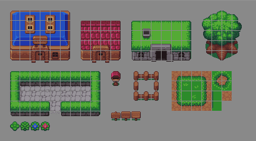
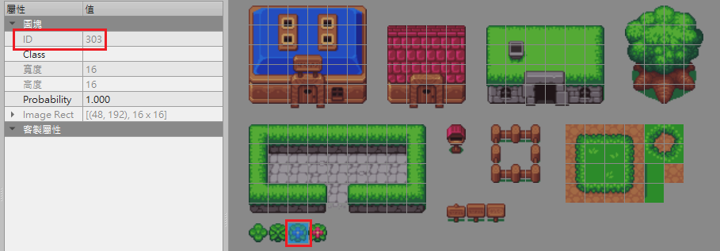
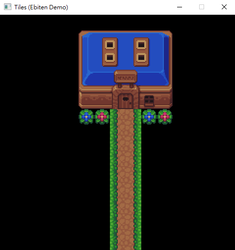

# Tiles

> See [Go: Image Rendering in 2D Video Games with Ebiten](https://medium.com/a-journey-with-go/go-image-rendering-in-2d-video-games-with-ebiten-912cc2360c4f) or [Tiles](https://ebiten.org/examples/tiles.html) for more information.

A example of ebitengine

## Tiled

我們可以把範例提供的地圖集使用 [Tiled](https://www.mapeditor.org/) 工具每 16 pixels 做劃分，共 25 * 14 格



劃分後的每一塊方格都會被標上一個從 0 開始遞增的編號，以地圖集中的藍色花為例，其編號為 303



有了編號後我們就可以得知藍色花在地圖集中的第 4 個 column(index=303%25=3)及第13個 row(index=303/25=12)
最後我們就可以把編號應用在我們想要呈現的結果
```go
var (
    // 預設 screen size 為 240 * 240
    // 240 除以格子邊長 16 等於 15
    // 所以一個圖層會有 15 * 15 個編號值
    layer = []int{
        0, 0, 0, 0, 0, 0, 0, 0, 0, 0, 0, 0, 0, 0, 0,
        0, 0, 0, 0, 0, 26, 27, 28, 29, 30, 31, 0, 0, 0, 0,
        0, 0, 0, 0, 0, 51, 52, 53, 54, 55, 56, 0, 0, 0, 0,
        0, 0, 0, 0, 0, 76, 77, 78, 79, 80, 81, 0, 0, 0, 0,
        0, 0, 0, 0, 0, 101, 102, 103, 104, 105, 106, 0, 0, 0, 0,

        0, 0, 0, 0, 0, 126, 127, 128, 129, 130, 131, 0, 0, 0, 0,
        0, 0, 0, 0, 0, 303, 304, 245, 242, 303, 304, 0, 0, 0, 0,
        0, 0, 0, 0, 0, 0, 0, 245, 242, 0, 0, 0, 0, 0, 0,
        0, 0, 0, 0, 0, 0, 0, 245, 242, 0, 0, 0, 0, 0, 0,
        0, 0, 0, 0, 0, 0, 0, 245, 242, 0, 0, 0, 0, 0, 0,

        0, 0, 0, 0, 0, 0, 0, 245, 242, 0, 0, 0, 0, 0, 0,
        0, 0, 0, 0, 0, 0, 0, 245, 242, 0, 0, 0, 0, 0, 0,
        0, 0, 0, 0, 0, 0, 0, 245, 242, 0, 0, 0, 0, 0, 0,
        0, 0, 0, 0, 0, 0, 0, 245, 242, 0, 0, 0, 0, 0, 0,
        0, 0, 0, 0, 0, 0, 0, 245, 242, 0, 0, 0, 0, 0, 0,
    }
)
```

實際畫出來的結果如下


